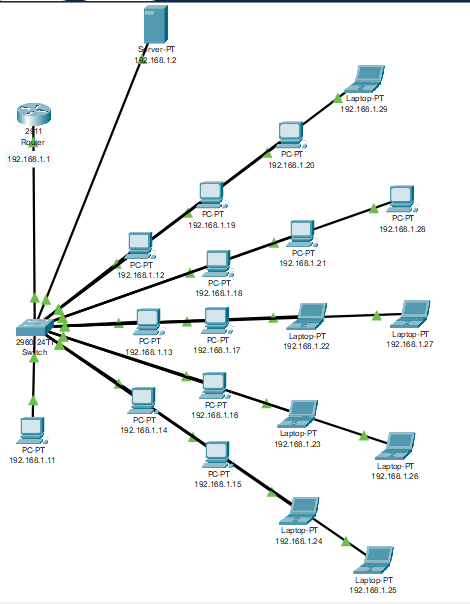

# 🌐 Smart Networking Lab – Beginner Project

A complete **Cisco Packet Tracer Project** designed for students to learn computer networking step by step.

---

## 📌 Problem Statement
Beginners in networking often face challenges in understanding how **servers, switches, and PCs communicate**. Configuring DHCP, static IPs, and services can feel confusing.  
This project provides a ready-to-use networking lab to make those concepts clear.

---

## 🎯 Learning Outcomes
- Understand LAN topology and device connections.
- Learn the difference between **Static IP vs. Dynamic IP (DHCP)**.
- Configure DHCP server in Packet Tracer.
- Set up a **Teacher PC with static IP**.
- Test network connectivity using `ping` and `ftp`.

---

## 🔑 Key Features
- Server with DHCP enabled.
- Teacher PC with fixed static IP (192.168.1.11).
- Student PCs with automatically assigned IPs.
- Expandable design (can add DNS, FTP, Web services later).
- Beginner-friendly structure.

---

## 🖥️ Network Topology
📍 Example Setup:  
- Router → 192.168.1.1 (Default Gateway, Interface G0/0)  
- Server → 192.168.1.2 (DHCP enabled)  
- Teacher PC → 192.168.1.11 (Static IP)  
- Student PCs → 192.168.1.12 – 192.168.1.50 (DHCP Range)  
- Switch → Central connection device  



---


## 📋 Prerequisites
- Cisco Packet Tracer 8.x or later
- Basic understanding of IP addressing
- Open `Campus_LAN_with_DHCP_&_Server.pkt` via File → Open

## 📊 Addressing Plan
| Item | Value |
|------|-------|
| Network | 192.168.1.0/24 |
| Gateway | 192.168.1.1 |
| Server (DHCP) | 192.168.1.2 |
| Teacher PC | 192.168.1.11 (Static) |
| DHCP Pool | 192.168.1.12–192.168.1.50 |
| DNS (optional) | 192.168.1.2 |
| Exclusions | 192.168.1.1, 192.168.1.11 |

## ⚙️ Step-by-Step Setup Guide

### 1️⃣ Connect Devices
- Place **1 Router, 1 Server, 1 Switch, 1 Teacher PC, multiple Student PCs**.
- Use **Copper Straight-Through cables**.
- Connect Router G0/0 to Switch, then connect all devices to Switch.

### 2️⃣ Configure Router
- Go to: `Router → Config → Interface G0/0`.
- Set:
  - IP Address: `192.168.1.1`
  - Subnet Mask: `255.255.255.0`
  - Status: `ON`
- CLI Configuration File: [`Router_Config_CLI.txt`](./Router_Config_CLI.txt)

### 3️⃣ Configure Server (DHCP)
- Go to: `Server → Services → DHCP`.
- Enable DHCP.
- Set:
  - Gateway: `192.168.1.1`
  - DNS: `192.168.1.2`
  - Start IP: `192.168.1.12`
  - Subnet Mask: `255.255.255.0`
  - Max Users: `30`
  - Add Excluded Addresses: `192.168.1.1, 192.168.1.11`

### 4️⃣ Configure Teacher PC (Static IP)
- Go to: `Desktop → IP Configuration`.
- Set:
  - IP: `192.168.1.11`
  - Subnet: `255.255.255.0`
  - Gateway: `192.168.1.1`

### 5️⃣ Configure Student PCs (DHCP)
- Go to: `Desktop → IP Configuration → DHCP`.
- IP will be auto-assigned (192.168.1.12 onwards).

### 6️⃣ Test Connectivity
- Open Command Prompt on Teacher PC:
  ```
  ping 192.168.1.2    # Ping Server
  ping 192.168.1.1    # Ping Router
  ipconfig            # Verify IP assignment
  ```
- Open Command Prompt on Student PC:
  ```
  ping 192.168.1.11   # Ping Teacher PC
  ping 192.168.1.2    # Ping Server
  ipconfig            # Verify DHCP IP
  ```
- If all pings successful → Network is working correctly.

---

## 📋 Student Step-by-Step Workflow
1. Connect all devices with cables (Router → Switch → All devices).  
2. Power on all devices.  
3. Configure router with gateway IP (192.168.1.1).  
4. Configure the server (DHCP ON, settings applied).  
5. Assign teacher PC a static IP.  
6. Configure student PCs to use DHCP.  
7. Test connectivity using ping commands.  
8. (Optional) Enable Web/FTP services on the server.  

---

## 🔍 Troubleshooting
- ❌ PC not getting IP → DHCP not enabled or router not configured.  
- ❌ Teacher PC IP conflict → Don't overlap DHCP range (exclude 192.168.1.11).  
- ❌ Ping timeout → Wrong cables, power issue, or router not configured.  
- ❌ FTP/Web not working → Enable services in Server.  
- ❌ No internet simulation → Add NAT configuration to router for internet access.  

---

## 🌟 Future Scope
- Add **Web Server** to host a webpage.  
- Add **FTP Server** for file sharing.  
- Add **DNS Server** for domain-based access.  
- Add **Router with NAT** for internet simulation.  
- Add **VLANs** to separate networks.  

---


## 📄 License
This project is licensed under the MIT License.

## 📅 Last Updated
September 2025
